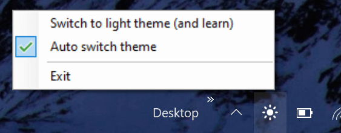
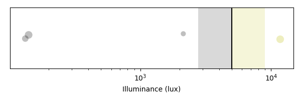

# BrightnessSwitch

_Do you have a notebook with Fn and function keys combined and have issues with combinations like <kbd>Alt</kbd>+<kbd>F4</kbd>? Make sure to also check out [FixSurfaceKeyboard](https://github.com/stephtr/FixSurfaceKeyboard)._

---

This small app automatically switches between Windows' Light- and Dark-Theme, depending on the ambient brightness, detected via your device's light sensor.

 
_Screenshot of the app_

In order to control the switching mechanism, it adds a tray icon where one can enable or disable automatic switching of themes, but also an option to manually switch the theme.

If automatic switching is enabled and one switches the theme, machine learning (support vector machine, to be precise) is being used for optimizing the automatic switching mechanism.

## Download

- [Microsoft Store](https://www.microsoft.com/store/productId/9NK5PND0SQ07)
- .zip package: [Latest release](https://github.com/stephtr/BrightnessSwitch/releases)

## Running the app

The easiest and recommended way is to use the [Microsoft Store](https://www.microsoft.com/store/productId/9NK5PND0SQ07) version. If you prefer to manually run the app, follow these instructions:

Download the [latest release](https://github.com/stephtr/BrightnessSwitch/releases) and extract it to a folder of your choice. The app is written in C# (.NET 5.0) and therefore needs the [Desktop Runtime 5.0](https://dotnet.microsoft.com/download/dotnet/5.0#runtime-desktop-5.0.0-preview.2) to be installed. Then run `BrightnessControl.exe`, autostart with Windows can be enabled via the context menu.

## Privacy

The app itself doesn't send any data to any server. For the Microsoft Store version, Windows may send some diagnostic informations to Microsoft.

## Building from source

For building the app from scratch, you need to have the [.NET SDK 5.0 (preview)](https://dotnet.microsoft.com/download/dotnet/5.0) installed.

After cloning or downloading the source, running `dotnet run` is sufficient for automatically restoring, building and running the app.

Included with the source is also a small Python script for analysing the app's SVM configuration. By running `analysis.py`, it shows a plot containing all your recent manual interventions as dots. The vertical line corresponds to the criteria for switching between light and dark theme with the shaded area being a measure for the uncertainty.

 
_Screenshot of the analysis tool_

## Changelog

For a list of recent changes, see the separate [Changelog](changelog.md).
